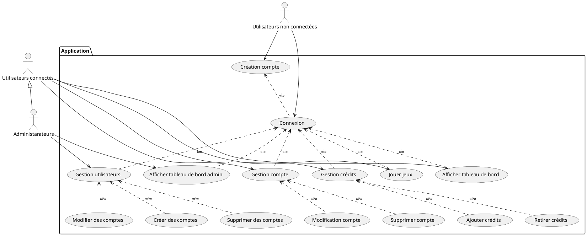
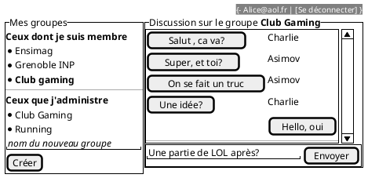

---
title: Projet React 
author:  
- A compléter avec vos noms
--- 

## Cahier des charges

Ici vous décrivez les fonctionnalités souhaitées et celles effectivement mises en oeuvre. Avec un diagramme UML des cas d'usage et des maquettes des vues souhaitées et des captures d'écran de ce qui a été réalisé.

### Cas d'usage



### Maquettes

A modifier/compléter...



### Captures d'écran

A compléter

### API mise en place

|Endpoint | GET  | POST | PUT  | DELETE  |
|---|---|---|---|---|
| /login  | *  | Obtention du token utilisateur/**email**,**password**  | *  | * |
| /register  | *  | Crée un utilisateur/**email**,**password**,**firstName**,**lastName**,**address**,**birthDate**  | * | * |
| /api/users  | (**TOKEN**,**ADMIN**)Lister tous les utilisateurs  | *  |  * |  * |
| /api/user | (**TOKEN**)Récupération des informations de l'utilisateur | * | (**TOKEN**)Modification des informations de l'utilisateur/**password**,**firstName**,**lastName**,**address**,**birthDate** | * |
| /api/users/{id}| * | * | (**TOKEN**, **ADMIN**)Mettre à jour les informations de l'utilisateur/**email**,**password**,**firstName**,**lastName**,**address**,**birthDate**,**isAdmin** |*

## Architecture du code

### FrontEnd

Indiquer ici l'organisation de votre code. Et les choix faits pour le frontend.

### Backend

#### Schéma de votre base de donnée

A modifier/compléter...

```plantuml
class User{
  -id: Number
  -firstName: String
  -lastName: String
  -email: String
  -password: String
  -address: String
  -birthDate: Date
  -balance: Float
  -isAdmin: Boolean
}

abstract Games{
  -id: Number
  -name: String
}

class Rocket implements Games{
}
class Mines implements Games{
}
class SlotMachine implements Games{
}

class History{
 -id: Number;
 -earnings: Float
 -timeStamp: Date
}


History *--> User
History *--> Games
```

#### Architecture de votre code

Indiquer ici l'organisation de votre code. Et les choix faits pour le backend.

### Gestion des rôles et droits

Expliquer ici les différents rôles mis en place, et comment ils sont gérés dans votre code.

- Coté backend

- Coté frontend


## Test

### Backend

Décrivez les tests faits au niveau du backend, leur couverture.

### Frontend

Décrivez les tests faits au niveau du backend, leur couverture.

## Intégration + déploiement (/3)

Décrivez ici les éléments mis en place au niveau de l'intégration continue 

## Installation

Donner les éléments pour installer l'application sur une machine nue à partir de votre dépôt
