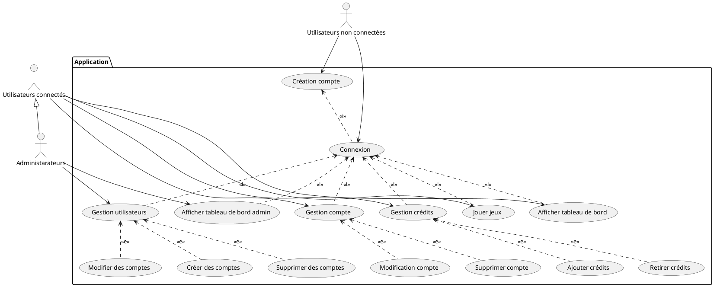
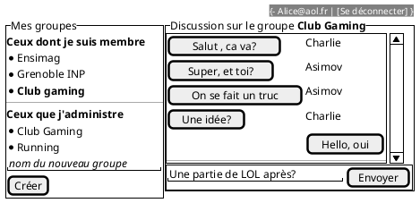

---
title: CasiDio 
author:  
- JOSSERAND Jordan
- LOIOIDICE Lukas
- NOGUEIRA Clement
--- 

**Lien du site :** [CasiDio](https://casidio.osc-fr1.scalingo.io/frontend/)

**Lien de la doc technique :** [Swagger CasiDio](https://casidio.osc-fr1.scalingo.io/doc/)

**Identifiants de connexion :**

* Utilisateur : 
  * Identifiant : jordan@josserand.com
  * Mot de passe : Ab*123-!
* Admin : 
  * Identifiant : a@a.com
  * Mot de passe : Ab*123-!

## Cahier des charges

Ici vous décrivez les fonctionnalités souhaitées et celles effectivement mises en oeuvre. Avec un diagramme UML des cas d'usage et des maquettes des vues souhaitées et des captures d'écran de ce qui a été réalisé.

### Cas d'usage



### Maquettes

A modifier/compléter...



### Captures d'écran

A compléter

### API mise en place

**User :**

|Endpoint | GET  | POST | PUT  | DELETE  |
|---|---|---|---|---|
| /login  | *  | Obtention du token utilisateur/**email**,**password**  | *  | * |
| /register  | *  | Crée un utilisateur/**email**,**password**,**firstName**,**lastName**,**address**,**birthDate**  | * | * |
| /api/users  | (**TOKEN**,**ADMIN**)Lister tous les utilisateurs  | *  |  * |  * |
| /api/user | (**TOKEN**)Récupération des informations de l'utilisateur | * | (**TOKEN**)Modification des informations de l'utilisateur/**password**,**firstName**,**lastName**,**address**,**birthDate** | (**TOKEN**)Suppression de l'utilisateur courant|
| /api/users/{id}| * | * | (**TOKEN**, **ADMIN**)Mettre à jour les informations de l'utilisateur/**email**,**password**,**firstName**,**lastName**,**address**,**birthDate**,**isAdmin** | (**TOKEN**, **ADMIN**) Suppression de l'utilisateur/

**Game :**
|Endpoint | GET  | POST | PUT  | DELETE  |
|---|---|---|---|---|
| /games  | Obtention de tout les jeux actuellement disponibles | * | *  | * |
| /api/game  | * | (**TOKEN**, **ADMIN**)Ajouter un nouveau jeu/**name, picturePath, description** | *  | * |
| /api/game/{id}  | * | * | (**TOKEN**, **ADMIN**)Modifier le jeu *id*/**name, picturePath, description** | (**TOKEN**, **ADMIN**)Supprimer le jeu *id* |

**History :**
|Endpoint | GET  | POST | PUT  | DELETE  |
|---|---|---|---|---|
| /api/globalHistory  | (**TOKEN**, **ADMIN**)Récupérer l'historique global | * | *  | * |
| /api/history  | (**TOKEN**)Récupérer l'historique de l'utilisateur connecté | * | *  | * |

**Game web socket :**
|Endpoint | parameters | description | return values |
|---|---|---|---|
|/gameSocket | game: *String*, Payload: *Object*, userToken: *String* | Lance une itération du jeu `game` pour l'utilisateur `userToken` avec les paramètres `Payload` propres au jeu | *Object* |

## Architecture du code

### FrontEnd

Indiquer ici l'organisation de votre code. Et les choix faits pour le frontend.

### Backend

#### Schéma de la base de donnée

```plantuml
class User{
  -id: Number
  -firstName: String
  -lastName: String
  -email: String
  -password: String
  -address: String
  -birthDate: Date
  -balance: Float
  -isAdmin: Boolean
}

class Games{
  -id: Number
  -name: String
  -page: String
  -description: String
}

class History{
 -id: Number;
 -profit: Float
 -gameDate: Date
}


History *--> User
History *--> Games
```

#### Architecture de votre code

Le backend s'appuie sur une architecture **Modèle Vue Contrôleur** (MVC) sans implémenter la vue, en effet le frontend s'occupant de ce point. Cette architecture est recommandée par [Express](https://expressjs.com/fr/) le **framework** utilisé pour le backend.

Le **modèle** accessible dans `src/models` sert d'interface entre le reste du code et [Sequelize](https://sequelize.org/) l'ORM utilisé qui fait l'interface entre notre modèle et une base de donnée physique.

Le **contrôleur** va définir dans `src/routes` les différents **endpoints REST** accessibles et leurs méthodes d'accès. Il va aussi définir les **handlers** de chaque route contenant toute la logique de l'application dans `src/controllers`.

Le **contrôleur** gère aussi des **web socket** accessibles dans `src/routes/gameWS` en plus des endpoints REST via la librairie [express-ws](https://github.com/HenningM/express-ws). En effet, la **logique des jeux** définis dans' src/controllers/gameWS`utilisant la web socket est important pour garder des jeux **stateless** et éviter que des utilisateurs malveillants contournent la sécurité définie.

### Gestion des rôles et droits

#### Backend

L'application ne demande pas de droits/rôles très complexes, la gestion de ces derniers est très simple.

Pour ce qui est des droits, il y a 3 types d'endpoints :
- **Endpoints simples** : tout le monde peut y accéder
- **Endpoints connecté** : il suffit d'être connecté pour y accéder
- **Endpoints admin** : il faut être connecté et administrateur de la plateforme pour y accéder

La vérification des droits pour les endpoints se fait via des middlewares.

La web socket est utilisable uniquement en étant **connectée**, cette dernière nécessite le token de l'utilisateur.

Un seul rôle est défini dans l'application : `isAdmin`, ce dernier permet d'accéder aux **endpoints admin**.

#### Frontend

## Test

### Backend

Pour les tests backend, chaque **endpoints REST** est testé via la librairie [jestjs](https://jestjs.io/fr/).

Pour chaque **endpoints** on définit des tests valides/non valides pour obtenir la **couverture de code** la plus large possible. La couverture est disponible dans `coverage/lcov-report/index.html`.

Cependant on fonctionne différemment pour tester la **web socket**, en effet, express/express-ws ne prenant pas en charge nativement l'accès aux web socket depuis une instance du serveur. On va donc **mock** une web socket permettant de simuler une exécution et récupérer les valeurs de sortie. On ne teste cependant pas ici le code présent dans le routeur.

### Frontend

Décrivez les tests faits au niveau du backend, leur couverture.

## Intégration + déploiement (/3)

Décrivez ici les éléments mis en place au niveau de l'intégration continue 

## Installation

Donner les éléments pour installer l'application sur une machine nue à partir de votre dépôt
