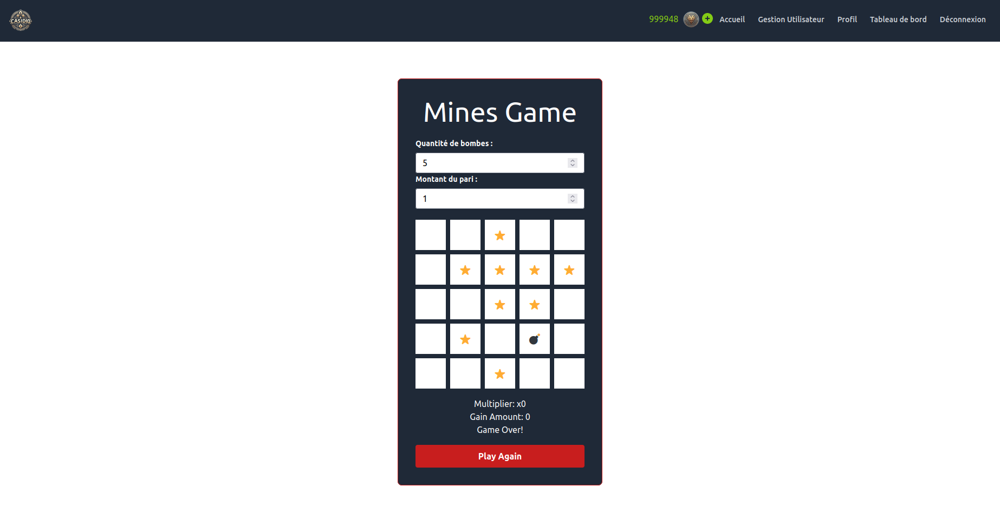

---
title: CasiDio 
author:  
- JOSSERAND Jordan
- LOIOIDICE Lukas
- NOGUEIRA Clement
--- 

**Lien du site :** [CasiDio](https://casidio.osc-fr1.scalingo.io/frontend/)

**Lien de la doc technique :** [Swagger CasiDio](https://casidio.osc-fr1.scalingo.io/doc/)

**Identifiants de connexion :**

* Utilisateur : 
  * Identifiant : jordan@josserand.com
  * Mot de passe : Ab*123-!
* Admin : 
  * Identifiant : a@a.com
  * Mot de passe : Ab*123-!

## Cahier des charges

### Cas d'usage


### Maquettes


### Captures d'écran

#### Connexion


#### Inscription


#### Accueil


#### Profil


#### Tableau de bord


#### Question API


#### ADMIN : Gestion utilisateur


#### ADMIN : Modification utilisateur


#### GAME : Machine à sous


Images des icones de Vecteezy.com

#### GAME : Mines



#### GAME : Roulette


### API mise en place

**User :**

|Endpoint | GET  | POST | PUT  | DELETE  |
|---|---|---|---|---|
| /login  | *  | Obtention du token utilisateur/**email**,**password**  | *  | * |
| /register  | *  | Crée un utilisateur/**email**,**password**,**firstName**,**lastName**,**address**,**birthDate**  | * | * |
| /api/users  | (**TOKEN**,**ADMIN**)Lister tous les utilisateurs  | *  |  * |  * |
| /api/user | (**TOKEN**)Récupération des informations de l'utilisateur | * | (**TOKEN**)Modification des informations de l'utilisateur/**password**,**firstName**,**lastName**,**address**,**birthDate** | (**TOKEN**)Suppression de l'utilisateur courant|
| /api/users/{id}| * | * | (**TOKEN**, **ADMIN**)Mettre à jour les informations de l'utilisateur/**email**,**password**,**firstName**,**lastName**,**address**,**birthDate**,**isAdmin** | (**TOKEN**, **ADMIN**) Suppression de l'utilisateur/

**Game :**
|Endpoint | GET  | POST | PUT  | DELETE  |
|---|---|---|---|---|
| /games  | Obtention de tout les jeux actuellement disponibles | * | *  | * |
| /api/game  | * | (**TOKEN**, **ADMIN**)Ajouter un nouveau jeu/**name, picturePath, description** | *  | * |
| /api/game/{id}  | * | * | (**TOKEN**, **ADMIN**)Modifier le jeu *id*/**name, picturePath, description** | (**TOKEN**, **ADMIN**)Supprimer le jeu *id* |

**History :**
|Endpoint | GET  | POST | PUT  | DELETE  |
|---|---|---|---|---|
| /api/globalHistory  | (**TOKEN**, **ADMIN**)Récupérer l'historique global | * | *  | * |
| /api/history  | (**TOKEN**)Récupérer l'historique de l'utilisateur connecté | * | *  | * |

**Game web socket :**
|Endpoint | parameters | description | return values |
|---|---|---|---|
|/gameSocket | game: *String*, Payload: *Object*, userToken: *String* | Lance une itération du jeu `game` pour l'utilisateur `userToken` avec les paramètres `Payload` propres au jeu | *Object* |

## Architecture du code

### Frontend

Pour le Frontend, nous utilisons le framework JavaScript de base [React](https://fr.react.dev/). Grâce à ça, on peut déclarer des composants réactifs avec des hooks ce qui nous permet de simplifier beaucoup la programmation. Pour notre code, il repose sur une structure assez classique avec une gestion de page. En effet, nous avons un élément React qui change dynamiquement pour appeler la page sur lequel l'utilisateur courant est. Il s'agit de `App.jsx`. Ensuite, chaque page est indépendante ce qui permet une gestion simplifier des pages. Des fonctions et des propriétés sont quand même partagés globalements pour se partager des informations. On peut parler ici de l'utilisateur, du token ou d'une fonction de changement de pages.

Certaines pages implémentent des composants qui permettent de factoriser et enlever de la duplication de code. On peut voir l'utilisation d'un composant `Card` dans la page Home qui affiche les différents jeux.

Voici l'arborescence de l'application React :
```
frontend/
|   
└───public/
|   └───images/
|
└───src/
|   ├───assets/
|   ├───components/
|   ├───pages/
|   └───AppContext.js
|
└───index.html

```

### Backend

#### Schéma de la base de donnée

```plantuml
class User{
  -id: Number
  -firstName: String
  -lastName: String
  -email: String
  -password: String
  -address: String
  -birthDate: Date
  -balance: Float
  -isAdmin: Boolean
}

class Games{
  -id: Number
  -name: String
  -page: String
  -description: String
}

class History{
 -id: Number;
 -profit: Float
 -gameDate: Date
}


History --> "1..1" User
History --> "1..1" Games
```

#### Architecture de votre code

Le backend s'appuie sur une architecture **Modèle Vue Contrôleur** (MVC) sans implémenter la vue, en effet le frontend s'occupant de ce point. Cette architecture est recommandée par [Express](https://expressjs.com/fr/) le **framework** utilisé pour le backend.

Le **modèle** accessible dans `src/models` sert d'interface entre le reste du code et [Sequelize](https://sequelize.org/) l'ORM utilisé qui fait l'interface entre notre modèle et une base de donnée physique.

Le **contrôleur** va définir dans `src/routes` les différents **endpoints REST** accessibles et leurs méthodes d'accès. Il va aussi définir les **handlers** de chaque route contenant toute la logique de l'application dans `src/controllers`.

Le **contrôleur** gère aussi des **web socket** accessibles dans `src/routes/gameWS` en plus des endpoints REST via la librairie [express-ws](https://github.com/HenningM/express-ws). En effet, la **logique des jeux** définis dans `src/controllers/gameWS` utilise la web socket car cela est important pour garder des jeux **stateless** et éviter que des utilisateurs malveillants contournent la sécurité définie.

### Gestion des rôles et droits

#### Backend

L'application ne demande pas de droits/rôles très complexes, la gestion de ces derniers est très simple.

Pour ce qui est des droits, il y a 3 types d'endpoints :
- **Endpoints simples** : tout le monde peut y accéder
- **Endpoints connecté** : il suffit d'être connecté pour y accéder
- **Endpoints admin** : il faut être connecté et administrateur de la plateforme pour y accéder

La vérification des droits pour les endpoints se fait via des middlewares.

La web socket est utilisable uniquement en étant **connectée**, cette dernière nécessite le token de l'utilisateur.

Un seul rôle est défini dans l'application : `isAdmin`, ce dernier permet d'accéder aux **endpoints admin**.

#### Frontend

Nous avons gérés les droits de différentes manières en fonction des pages. En effet, selon nos cas d'usage, on différencie 3 droits possibles :
- Les **utilisateurs non connectés**
- Les **utilisateurs**
- Les **administrateurs**

Pour les **utilisateurs non connectés**, ils peuvent accéder uniquement à trois pages :
- La page de connexion
- La page d'inscription
- La page d'accueil

Quand on est sur la page d'accueil et non connecté, nous pouvons voir les jeux (vu qu'ils sont publiques) mais si on clique sur un jeu, nous sommes automatiquement redirigés sur la page de connexion.

Quand on est un utilisateur connecté, on peut se connecter et accéder aux pages :
- La page d'accueil
- Son tableau de bord
- La page de modification de profil
- La page du jeu de roulette
- La page du jeu de mine
- La page du jeu de machine à sous

Pour l'administrateur, il a accès à toutes les pages d'un utilisateur connecté mais avec des pages en plus :
- La page de gestion d'utilisateurs (modification et suppression)
- Le tableau de bord admin

## Test

### Backend

Pour les tests backend, chaque **endpoints REST** est testé via la librairie [jestjs](https://jestjs.io/fr/). Ces tests sont définis dans `src/__tests__/`.

Pour chaque **endpoints** on définit des tests valides/non valides pour obtenir la **couverture de code** la plus large possible. La couverture est disponible dans `coverage/lcov-report/index.html` ou [ici](https://casidio-clement-nogueira-jordan-josserand-lukas--5cab9acc7267a7.pages.ensimag.fr/backend/) sur les pages

Cependant on fonctionne différemment pour tester la **web socket**, en effet, express/express-ws ne prenant pas en charge nativement l'accès aux web socket depuis une instance du serveur. On va donc **mock une web socket** permettant de simuler une exécution et récupérer les valeurs de sortie. On ne teste cependant pas ici le code présent dans le routeur.

### Frontend

Pour les tests frontend, on utilise la librairie [Cypress](https://www.cypress.io/) dans une méthode end2end. En effet, il n'y avait pas de sens d'utiliser des tests unitaires sur une application qui requiert un token de connexion et/ou un droit d'admin.

L'idée était donc de tester le frontend selon un **chemin** :
- Connexion
- Inscription
- Questions API
- Machine à sous
- Mines
- Roulette
- Page gestion admin
- Tableau de bord
- Profil

Toutes les étapes sont testés en mode admin pour éviter de se déconnecter et se reconnecter à chaque fonctionnalité.

Une des difficulté que nous avons eu est le test des **web sockets**. En effet, il est très difficile voire presque impossible de tester les web sockets dans cypress pour le moment. Une solution que nous avons utilisés est le fait d'utiliser une variable d'environnement qui asse à 1 si nous sommes en mode test. De ce fait, nous pouvons directement modifier les résultats des requêtes pour mettre nos données à la place et tester les différents cas de figures.

Nous avons aussi rajouté des **plugins** sur Cypress pour nous permettre d'avoir une couverture de code. Vous pouvez la retrouver dans les badges de gitlab ou bien [ici](https://casidio-clement-nogueira-jordan-josserand-lukas--5cab9acc7267a7.pages.ensimag.fr/frontend/) sur les pages.

## Intégration + déploiement (/3)

Pour l'intégration et le déploiement continu, nous utilisons la [pipeline gitlab](https://docs.gitlab.com/ee/ci/pipelines/).

Cette dernière contient cinq étapes :
- **test** : Lancement des tests backend et frontend.
- **lint** : Lancement de la vérification de code backend et frontend.
- **badges** : Création des badges pour les **tests frontend/backend**, la **couverture de code frontend/backend** et la **vérification de code frontend/backend**.
- **pages** : Mise en place du détail de la couverture de code [frontend](https://casidio-clement-nogueira-jordan-josserand-lukas--5cab9acc7267a7.pages.ensimag.fr/frontend/) et [backend](https://casidio-clement-nogueira-jordan-josserand-lukas--5cab9acc7267a7.pages.ensimag.fr/backend/) sur les pages statiques du dépôt git.
- **deploy** : Exposition de l'API et du frontend via [Scalingo](https://scalingo.com/fr) permettant le déploiement et l'hébergement de l'application disponible [ici](https://casidio.osc-fr1.scalingo.io/frontend/).

## Installation

### Pré-requis

Pour pouvoir développer l'application, il suffira d'installer [Node.js](https://nodejs.org/en/download/package-manager), ce dernier est censé contenir [NPM](https://www.npmjs.com/) permettant la gestion des modules.

Pour vérifier l'installation :

```powershell
node -v #v20.11.1
```
```powershell
npm -v #10.2.4
```

### Dépendances

Il faut dans un premier temps bien comprendre que nous avons deux modules nodes : `frontend/` et `backend/`. Chacuns d'eux contenant leurs propres dépendances et frameworks.

Pour obtenir le strict minimum avant de tester l'application il faut vous rendre dans le module voulus et installer les dépendances :
```shell
npm install
```
### Comandes

Une fois les dépendances installées, il sera possible d'exécuter les différents scripts pour développer l'application.

#### Frontend

-    **dev** : Lancement du serveur frontend en mode developpement.
-    **build** : Génération du code statique.
-    **buildProd** : Génération du code statique avec la définition des endpoints back pour le déploiement sur Scalingo.
-    **lint** : Lancement de la vérification de code.

#### Backend

Pour le backend, les commandes contenant le suffix `WIN` sont à simplement lancer sur Windows.

- **updatedb** : Supression de la base de données locales et génération d'une nouvelle avec les données présentes dans `src/util/updatedb.js`.
- **doc** : Génération de la documentation technique via l'outil [Swagger](https://swagger.io/).
- **start** : Lancement des scripts `doc` et `updatedb` puis lancement du serveur.
- **test** : Lancement du script `updatedb` puis lancement des tests sans parallélisme, ordonné dans `index.spec.js` et couverture de code.
- **startdev** : Lancement du script `doc` puis lancement du serveur.
- **lint** : Lancement de la vérification de code.
